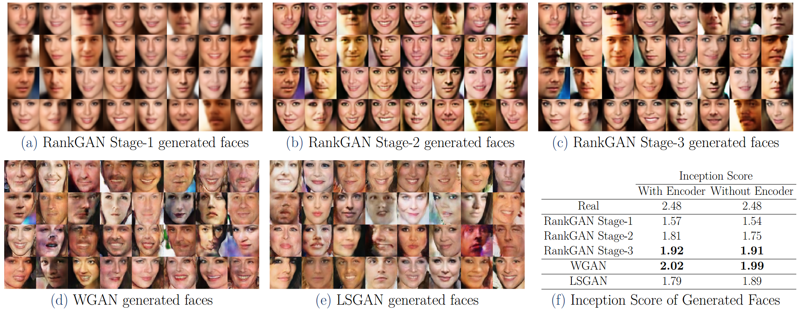
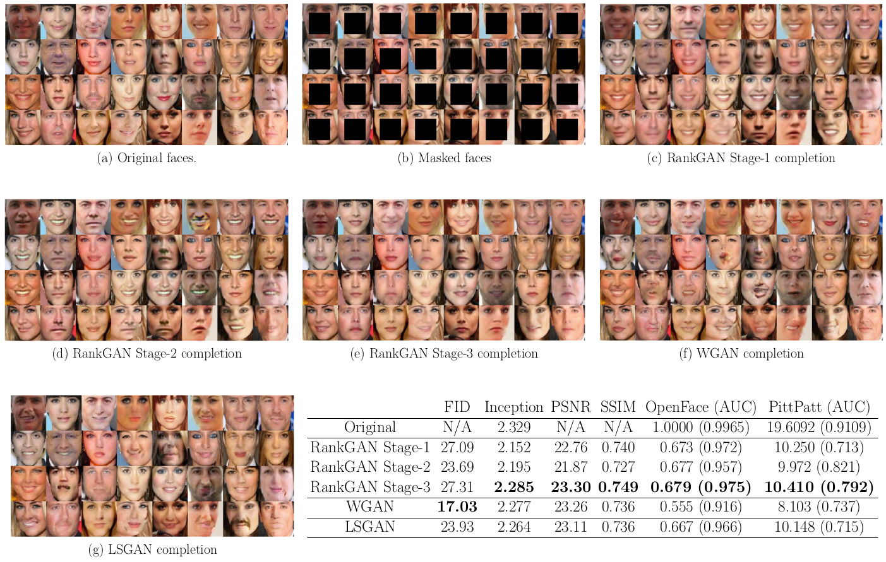

# RankGAN

### Abstract
We present a new stage-wise learning paradigm for training generative adversarial networks (GANs). The goal of our work is to progressively strengthen the discriminator and thus, the generators, with each subsequent stage without changing the network architecture. We call this proposed method the RankGAN. We first propose a margin-based loss for the GAN discriminator. We then extend it to a margin-based ranking loss to train the multiple stages of RankGAN. We focus on face images from the CelebA dataset in our work and show visual as well as quantitative improvements in face generation and completion tasks over other GAN approaches, including WGAN and LSGAN.

***

### Overview

Ranking based Progressive Training in RankGAN.

RankGAN Training Flowchart and Architecture.

***

### Contributions
* A progressive training framework where GANs at later stages improve upon their earlier versions.
* A margin-based Ranking Loss function to train GANs.
* Evaluation of GANs based on image completion tasks.

***

### Results

Visual and quantitative results on face generation with RankGAN, WGAN and LSGAN.

Image Completion Results.

### References

1. Rahul Dey, Felix Juefei-Xu, Vishnu Naresh Boddeti and Marios Savvides. [**RankGAN: A Maximum Margin Ranking GAN for Generating Faces.**](https://arxiv.org/abs/1812.08196) Asian Conference on Computer Vision (ACCV 2018.

